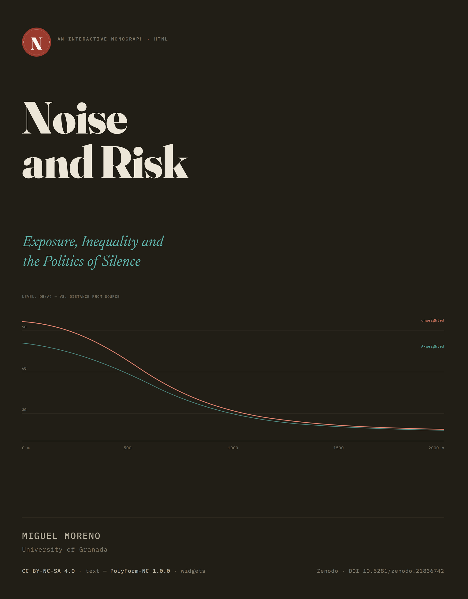

# Noise and Risk

### *Exposure, Inequality and the Politics of Silence*

[](https://doi.org/10.5281/zenodo.21836742)
[](https://noise-and-risk.vercel.app/)
[](https://creativecommons.org/licenses/by-nc-sa/4.0/)
[](https://polyformproject.org/licenses/noncommercial/1.0.0/)
[](https://github.com/utilizas/noise)

---

<p align="left">
  
  <br>
  <sub>Cover composed with Claude Sonnet 5 (Anthropic). HTML/CSS/SVG typeset in the book's <br>
    own typefaces and rendered via headless Chromium, not generative image synthesis.</sub>
</p>

**Noise and Risk** is an interactive HTML monograph built across twelve chapters in three parts, plus a full scholarly apparatus, and carries fifteen self-contained interactive simulators. Every simulator computes on the value the reader enters; none is a fixed animation.

## Author

Miguel Moreno — University of Granada (Spain)

## Abstract

Environmental noise has moved, in the epidemiological literature, from nuisance to a graded, no-threshold cardiovascular, metabolic and cognitive risk factor. This monograph sets out that shift and what follows from it: the sources producing environmental noise, and the instruments used to measure it, are both changing faster than the governance meant to contain them. Twelve chapters in three parts carry the argument. 

Part I establishes noise as a measurable acoustic object and examines the epistemology of its measurement — what a decibel reading includes, and, more consequentially, what it leaves out. Part II follows the sources reshaping the soundscape as the energy and digital transitions unfold: traffic, the electric vehicle and its mandated warning sound, heat pumps, data centres, and the indoor environments where noise degrades attention rather than comfort. Part III turns to distribution, governance and design — who bears the unequal burden of exposure, what the standard metric renders visible or invisible to regulators, and how soundscape design offers an affirmative alternative to abatement alone. A through-line beneath Chapters 2, 7 and 11, never signposted in the prose itself, asks what instruments of measurement render visible or invisible, and who benefits from that invisibility — an argument in the philosophy of science and agnotology applied to a material, measurable object, not a metaphor.

Every empirical claim is anchored to a verified primary source: international standards, WHO guidance, EU directives and their national transpositions, and case law. Fifteen self-contained interactive simulators accompany the twelve chapters, each computing on the parameter the reader sets rather than illustrating a fixed result. 

## Keywords

Environmental noise · noise pollution · soundscape · ISO 12913 · A-weighting · exposure–response · cardiovascular risk · Environmental Noise Directive · CNOSSOS-EU · WHO environmental noise guidelines · strategic noise mapping · environmental justice · sonic injustice · agnotology · noise governance · data centres · energy transition · electric vehicles · heat pumps · wind turbines · soundscape design · interactive monograph · Quarto

## Reading the book

The rendered book is deployed identically to four addresses. Vercel is canonical; the remainder are mirrors, kept in sync so that any one of them is a complete substitute should another become unavailable.

| Host | Address | Role |
|---|---|---|
| Vercel | [`noise-and-risk.vercel.app`](https://noise-and-risk.vercel.app/) | Canonical |
| GitHub Pages | [`utilizas.github.io/noise`](https://utilizas.github.io/noise/) | Mirror |
| Netlify | [`noise-risk.netlify.app`](https://noise-risk.netlify.app/) | Mirror |
| Cloudflare | [`noise-and-risk.utilizas.workers.dev`](https://noise-and-risk.utilizas.workers.dev) | Mirror |

None of these addresses is the correct target for citation. For that, see [Citation](#citation) below.

## Structure

Three parts, twelve chapters, front and back matter.

<p><strong>Part I · The object</strong> — what noise is, and how it is known</p>
<ol>
<li>What counts as noise</li>
<li>Measuring the invisible</li>
<li>The body under sound</li>
<li>The maps</li>
</ol>
<p><strong>Part II · The sources</strong> — a changing acoustic world</p>
<ol start="5">
<li>Traffic, the old giant</li>
<li>The quiet that wasn't</li>
<li>The machine hum</li>
<li>The indoor and the personal</li>
</ol>
<p><strong>Part III · The politics</strong> — distribution, governance and design</p>
<ol start="9">
<li>Sonic injustice</li>
<li>The economics of quiet</li>
<li>Governing sound</li>
<li>Designing the soundscape</li>
</ol>

**Apparatus** — preface, introduction, epilogue, appendix (methods and data provenance), glossary, and a fully sourced `references.bib`.

The through-line connecting Chapters 2, 7 and 11 — what a measuring instrument renders visible or invisible, and who benefits from that invisibility — is structural rather than a recurring slogan, and is not signposted in the prose.

## The interactive layer

Each of the fifteen simulators is a self-contained HTML file with CSS and JavaScript inline, inserted per chapter by iframe, so that any one can be opened, audited or reused independently of the book that hosts it. Where a simulator embodies a statistical model — an exposure–response function, a propagation model, a predictive pleasantness model — the model, its reference category and its range of valid extrapolation are stated on the widget itself, not only in the surrounding prose. Full provenance for each simulator's underlying data, and the parameter each one takes and returns, is tabulated in the book's own appendix.

## Data and reproducibility

The book is a Quarto project rendered to HTML only, with `execute: freeze` set so that computed outputs are cached and the rendered book is stable between builds. Source data behind each chapter's principal figure or simulator is downloaded with its access date recorded, cleaned in R using a tidyverse pipeline, and exported as flat JSON for the corresponding widget to consume. No figure appears without a cited source and access date; where a value is extrapolated beyond the range in which it was measured, the figure marks this rather than presenting it as a point measurement. The reference list is managed in a single `references.bib`, formatted to APA 7th edition, with a DOI recorded for every source that carries one.

## Repository structure

```
noise/
├── index.qmd                  # preface
├── introduction.qmd
├── 01-what-counts.qmd … 12-designing.qmd
├── epilogue.qmd
├── appendix.qmd                # methods, data provenance, AI declaration, citation
├── glossary.qmd
├── references.bib
├── _quarto.yml
├── widgets/                    # the fifteen self-contained simulators
├── R/                          # data-cleaning scripts (raw → clean → JSON)
├── data/
│   ├── raw/                    # source data as downloaded, with access dates
│   ├── clean/
│   └── json/                   # widget-facing exports
├── assets/
│   └── _meta-tags.html         # OG / Twitter Card / Dublin Core / JSON-LD, theme bridge
├── LICENSE                     # CC BY-NC-SA 4.0 — prose
└── LICENSE-CODE                # PolyForm Noncommercial 1.0.0 — widgets
```

This tree reflects the project's declared layout rather than a verified directory listing; adjust paths above to match the repository if they have since diverged.


## Citation

The interactive text above is where the argument and its simulators actually run, and no one mirror is more authoritative than another as a place to *read* the work. For citation, use the fixed record on Zenodo, which assigns a persistent DOI and preserves a permanent snapshot independent of any single host remaining online. APA 7th‑edition citation:

> Moreno, Miguel (2026). *Noise and Risk: Exposure, inequality and the politics of silence* (Version 1.0) [Interactive HTML monograph]. Zenodo. <https://doi.org/10.5281/zenodo.21836742>

### BibTeX

```bibtex
@misc{moreno2026noise,
  author    = {Moreno, Miguel},
  title     = {Noise and Risk: Exposure, Inequality and the Politics of Silence},
  year      = {2026},
  note      = {Version 1.0},
  publisher = {Zenodo},
  doi       = {10.5281/zenodo.21836742},
  url       = {https://doi.org/10.5281/zenodo.21836742}
}
```

## Licence

Two licences apply to different parts of this repository.

**Prose** — all chapter text, front matter and back matter — is released under a **Creative Commons Attribution-NonCommercial-ShareAlike 4.0 International licence** (CC BY-NC-SA 4.0). Reuse and adaptation are permitted with attribution, for non-commercial purposes, and under the same licence for any derivative. Full text: [creativecommons.org/licenses/by-nc-sa/4.0](https://creativecommons.org/licenses/by-nc-sa/4.0/). 

**Widgets** — all fifteen self-contained HTML/CSS/JavaScript simulators listed in the appendix, without exception — are released under the **PolyForm Noncommercial License 1.0.0** (SPDX identifier `PolyForm-Noncommercial-1.0.0`), since Creative Commons terms are not designed for software. Full text: [polyformproject.org/licenses/noncommercial/1.0.0](https://polyformproject.org/licenses/noncommercial/1.0.0/).  

This declaration governs every widget from the date of publication, including any that does not yet carry its own leading `SPDX-License-Identifier` comment.

## On the use of AI

AI assistance was used across this project's phases — architecture proposals, primary-source verification, drafting to specification, simulator construction with independently checked arithmetic, and citation formatting — under the author's direction and final judgement throughout. No identifier or URL was ever inferred to close a gap: where a source could not be verified, the claim it would have supported waited rather than entering the text provisionally. The full declaration, including what this delegates and what it explicitly does not, is given in the book's [appendix](https://noise-and-risk.vercel.app/appendix.html).
